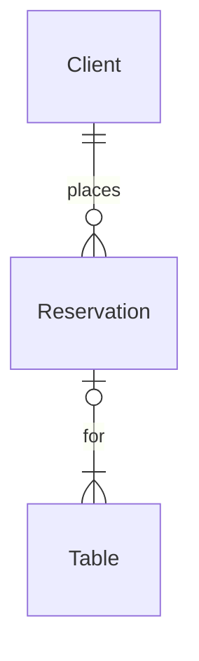

# SavourSync
# A system for placing reservations at a restaurant

 
 

**Version 1.0.0-dev** 

This application was made using **Intellij**  
The UI was designed using **JFormDesigner**  
The reports were made with **JaspersoftStudio**  
The database was managed via **XAMPP** with MySQL as the language

# HOW TO RUN 

- add lib to CLASSPATH
- create a database in _localhost:3306_ using [___scripts.sql___](script.sql)
- run [___Main.java___](src/Main.java)

# Functionality
- place a reservation
- manage tables
- check availability of tables
- view reservations
- view capacity occupied
- generate reports on 
  - daily reservations
  - daily canceled reservations

## Key Views

- [x] placing reservations (form)
  - [x] check availability 
  - [x] select date and time
  - [x] select table, check if this timeslot is available
   

- [x] Dashboard:
    - [x] list of reservations for the day
    - [x] list of upcoming reservations
    - [x] Capacity as a percentage
    - [x] add/delete tables

- [x] Report:
  - [x] Daily report
  - [x] Cancellations report

## DB structure

